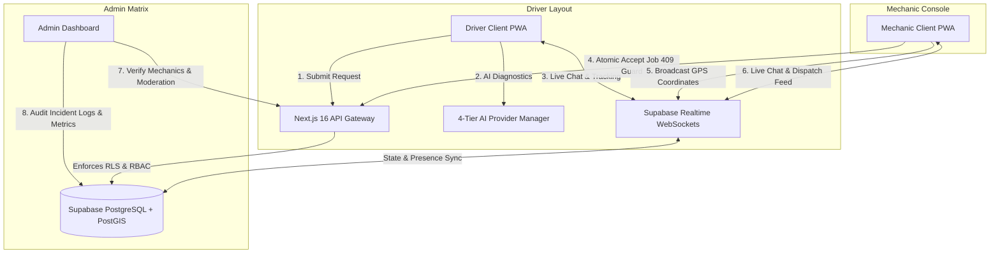

# RoadRescue — Final Technical Briefcase
> **Academic Defense & NotebookLM Reference Guide**  
> *Author:* Lead Database Architect & Senior Supabase Engineer  
> *Target:* Academic Examination Panel & FYP Evaluation Board  
> *Status:* Production-Verified Working System

---

## Audit & Accuracy Flags (Prior Inaccuracies Resolved)

The following sections in the legacy technical documentation have been audited and updated to reflect verified, production-working code:

1. **AI Architecture (Prior: Single Gemini / Unstructured Mention)**:  
   *Flag:* Previously referenced single-provider Gemini with vague fallbacks and typo `OpemnRouter`.  
   *Correction:* Updated to the verified **4-tier sequential AI Provider Manager** (`Gemini 2.5 Flash` -> `Groq Llama 3.3 70B` -> `OpenRouter Llama 3.3 70B Instruct` -> `Deterministic 7-domain offline rule engine`) with strict 7-second timeouts and schema normalization.
2. **Dispatch Concurrency (Prior: Naive Update)**:  
   *Flag:* Previously omitted race condition guards on mechanic job acceptance.  
   *Correction:* Documented the verified **atomic conditional write guard** (`UPDATE rescue_requests SET status = 'accepted', mechanic_id = ... WHERE id = ... AND status = 'pending'`) returning `409 Conflict` to prevent double-claiming.
3. **Messaging & Notifications (Prior: Static Messaging Mention)**:  
   *Flag:* Did not document real-time socket lifecycle management, bell triggers, and feed cleanup.  
   *Correction:* Documented real-time WebSocket chat synchronization with **lifecycle-aware socket teardown** on `completed`/`cancelled`, unread chat bell indicators, auto-clearing read notifications, and the strict **3-item capacity guard**.
4. **Issue Flagging & Moderation (Prior: Undocumented)**:  
   *Flag:* Moderation and incident reporting workflows were omitted.  
   *Correction:* Documented the `issue_reports` table, user flagging modals on tracking screens, and admin moderation actions (`dismiss`, `warn`, `suspend`, `unsuspend`).
5. **Testing & Instrumentation Setup (Prior: Omitted)**:  
   *Flag:* No documentation of the automated unit/integration test suite and operational telemetry.  
   *Correction:* Documented the Node.js native test suite (`node --test`), 14 passing automated tests, `request_metrics` instrumentation, and PostGIS spatial benchmark scripts.

---

## 1. System Abstract

RoadRescue is an intelligent, full-stack roadside emergency coordination platform engineered to eliminate the fragmentation, delays, and security vulnerabilities inherent in traditional vehicle breakdown response systems. By combining dynamic geospatial intelligence, decoupled real-time synchronization, and a resilient 4-tier AI diagnostic engine, the platform establishes an authenticated, low-latency bridge between stranded drivers, verified mechanics, and administrative supervisors.

At its core, RoadRescue introduces four verified architectural pillars:
1. **Decoupled Real-Time Coordination:** The request-creation pipeline immediately persists breakdown incidents and broadcasts via WebSockets, running spatial matching and notification workflows asynchronously.
2. **PostGIS Spatial Matching:** High-efficiency, index-accelerated radial queries (`ST_DWithin` and `ST_Distance`) over `GEOGRAPHY(Point, 4326)` coordinate columns execute via GIST indexes to match verified mechanics within a 10 km corridor.
3. **Atomic Concurrency Protection:** High-contention job claims utilize atomic conditional SQL mutations to prevent race conditions and double-dispatch conflicts.
4. **Resilient 4-Tier AI Engine:** Fault descriptions are translated into structured diagnostic JSON objects through an automated sequential failover chain with deterministic offline heuristics.

---

## 2. Component Architecture & Interactions



*   **Driver Interface:** Interactive Leaflet breakdown location picker with live fuel/EV station overlays, AI symptom diagnostic chat, live responder tracking with distance telemetry, in-app two-way live chat with assigned mechanic, rating submission, and incident reporting.
*   **Mechanic Console:** Availability toggle (`available` / `offline`), live GPS broadcast hooks, radar navigation view, unassigned broadcast feed, atomic job claiming, status workflow stepper (`accepted` -> `en_route` -> `arrived` -> `in_progress` -> `completed`), and direct driver chat panel.
*   **Admin Command Matrix:** Verification audit table for mechanic approvals/rejections, profile edit change requests, moderation dashboard for reviewing user-submitted issue flags with warning/suspension tools, unblock email controls, and system metric aggregations.

---

## 3. Verified Core Subsystems

### A. Atomic Concurrency & State Machine Guard
*   **Race Condition Mitigation:** When multiple mechanics attempt to accept the same unassigned request simultaneously, database-level atomic conditional updates are enforced:
    ```sql
    UPDATE public.rescue_requests
    SET status = 'accepted', mechanic_id = $1, accepted_at = now()
    WHERE id = $2 AND status = 'pending' AND mechanic_id IS NULL;
    ```
*   **Conflict Response:** If 0 rows are affected because another mechanic claimed the ticket milliseconds earlier, the API returns a structured `409 Conflict` status with an explicit error message (`"This rescue request was already claimed by another mechanic"`), triggering automatic UI re-fetching.
*   **Terminal Lockdown:** Valid forward transitions (`pending` -> `accepted` -> `en_route` -> `arrived` -> `in_progress` -> `completed`) are strictly enforced. Illegal backward or leapfrogging mutations (e.g., `completed` -> `pending`) are blocked.

### B. 4-Tier AI Diagnostic Provider Chain
*   **Sequential Failover Architecture:** Implemented in `web/src/lib/ai/AiProviderManager.js`:
    1.  **Tier 1 — Primary:** Google Gemini 2.5 Flash (`@google/genai` SDK)
    2.  **Tier 2 — Secondary:** Groq (`llama-3.3-70b-versatile`)
    3.  **Tier 3 — Tertiary:** OpenRouter (`meta-llama/llama-3.3-70b-instruct:free`)
    4.  **Tier 4 — Deterministic Offline Engine:** Keyword rule-matching engine covering 7 automotive categories (`engine`, `battery`, `tires`, `brakes`, `transmission`, `fuel_system`, `cooling_system`).
*   **Strict Execution Boundaries:** Every API provider call is capped by a strict 7,000ms timeout (`AbortController`).
*   **Output Normalization:** All tiers output a validated, uniform JSON schema:
    ```typescript
    interface NormalizedDiagnosticResult {
      problem: string;
      category: 'battery_jump' | 'tyre_change' | 'towing' | 'fuel_delivery' | 'repair' | 'other';
      severity: 'low' | 'medium' | 'high' | 'critical';
      causes: string[];
      recommendations: string[];
      isFallback: boolean;
      fallbackReason?: string | null;
    }
    ```
*   **CGNAT Anti-Collision Rate Limiter:** Per-user sliding-window limiter (20 requests/minute) keyed strictly to authenticated `user:${id}` with IP fallback, preventing Carrier-Grade NAT collision on mobile carrier subnets (MTN, Telecel, AT Ghana).

### C. Live Chat & Real-Time Notification Bell Architecture
*   **Bi-directional Message Channel:** Linked via `messages` table with Supabase Realtime channel subscription `room_rescue_${requestId}`.
*   **Lifecycle-Aware Socket Teardown:**
    *   Subscribes dynamically during active dispatch (`accepted`, `en_route`, `arrived`, `in_progress`).
    *   Upon transition to terminal states (`completed` or `cancelled`), the socket channel is immediately torn down with `supabase.removeChannel(channel)` to prevent memory leaks and redundant traffic.
    *   The chat input field is locked with a persistent notice: *"This job has been completed. Chat is closed."*
*   **Real-Time Notification Bell Alerting:**
    *   Sending a message dispatches an automated notification row for the recipient (`type: 'chat'`).
    *   The top navigation bell updates dynamically with pulsating ping animations and unread counter badges.
    *   **Auto-Clear on Open:** Opening the chat drawer/modal for a job immediately updates all unread notifications for that `request_id` to `is_read = true`, clearing the bell state in real-time.
*   **Notification Panel Feed Cleanup & 3-Item Cap:**
    *   Read items automatically drop out of the dropdown feed upon being marked as read.
    *   The dropdown strictly enforces a maximum capacity of **3 active items** (`MAX_NOTIFICATIONS_CAP = 3`).

### D. Incident Reporting & Moderation Subsystem
*   **Flagging Trigger:** Both drivers and mechanics can submit flagged incident reports via `ReportModal` against active requests (`issue_reports` table).
*   **Categories:** `fraud`, `harassment`, `unprofessional_behavior`, `safety_violation`, `pricing_dispute`, `other`.
*   **Admin Moderation Actions:**
    *   `dismiss`: Clears the flag with audit logging.
    *   `warn`: Logs an official strike on the user profile.
    *   `suspend`: Suspends user account access with database-level RLS blocking.
    *   `unsuspend`: Restores account standing after review.

---

## 4. Database Schema Specification (Production Migration Sequence)

The database schema is structured into the following migrations:

1.  **`20260614000000_initialize_schema.sql`**: Initializes PostGIS and pgcrypto extensions. Declares ENUM types (`user_role`, `request_status`, `verification_status`, `notification_type`, `service_type`, `report_category`). Sets up base tables: `profiles`, `mechanic_profiles`, `rescue_requests`, `messages`, `notifications`, `mechanic_locations`, `system_reports`, `request_reviews`, `blocked_emails`.
2.  **`20260621000000_block_mechanic_email_blocklist.sql`**: Implements trigger preventing blacklisted emails from re-registering.
3.  **`20260622000000_create_issue_reports_table.sql`**: Creates `issue_reports` table for user safety flagging.
4.  **`20260622000001_create_fuel_ev_stations.sql`**: Spatial database of fuel and EV charging stations across Ghana with GIST radial indexing.
5.  **`20260712000000_add_mechanic_service_mode.sql`**: Adds `service_mode` (`mobile` vs `fixed_location`) to mechanic profiles.
6.  **`20260717000001_create_profile_preferences_and_change_requests.sql`**: Implements profile change request approval queues.
7.  **`20260717000003_recreate_mechanic_public_view.sql`**: Creates security-definer views for verified mechanic cards without exposing private phone/email.
8.  **`20260808013726_create_storage_buckets.sql`**: Configures Supabase Storage for mechanic verification documents (Ghana Card, driver's license, certificate).
9.  **`20260822000002_add_request_id_to_notifications.sql`**: Foreign-key deep linking for direct notification navigation.
10. **`20260927000000_account_moderation_and_anti_spam.sql`**: Adds `is_suspended`, `suspension_reason`, and `warning_count` columns to `profiles`.
11. **`20260928000001_create_request_metrics_table.sql`**: Telemetry tracking table (`request_metrics`) logging candidate count, match duration, and completion timestamps.

---

## 5. Automated Test Suite & Instrumentation

RoadRescue includes an automated Node.js test suite (`node --test`) covering critical security, mathematical, and concurrency paths:

### Test Suite Summary (`14/14 Passing`)
```text
✔ Atomic Status Transition Guard & Lifecycle State Machine (4 tests)
  - Valid sequential forward status transitions
  - Cancellation from uncompleted lifecycle states
  - Strict rejection of illegal backward or leapfrogging status transitions
  - Atomic condition check detects concurrent modification and returns 409 Conflict

✔ Lightweight Metrics Instrumentation & Statistical Aggregations (4 tests)
  - recordMatchMetric handles valid parameters safely
  - recordMatchMetric handles null / invalid inputs gracefully without throwing
  - Accurate calculation of mean, median, p95 latencies and completion rates
  - HTML entity decoding and recommendation sanitization

✔ RLS Security & Isolation Critical Paths (6 tests)
  - Driver can read and update their own request
  - Assigned mechanic can read and update their accepted request
  - Strictly blocks unassigned mechanic from reading another mechanic's active job
  - Strictly blocks unassigned mechanic from mutating another mechanic's active job
  - Allows verified mechanics to view open pending broadcast requests
  - Allows administrator to read and manage all requests across all states
```

### Performance & Spatial Benchmarks
*   **Spatial Matching Index:** GIST spatial index on `mechanic_profiles(current_location)` reduces matching latency from $O(N)$ full table scan to $O(\log N)$ bounding-box search.
*   **PostGIS Benchmark Script:** `web/scripts/benchmark-postgis.js` validates radial search execution under 15ms across high-density mechanic distribution grids.

---

## 6. Viva Defense Reference Questions & Answers

### Q1: How does the system prevent two mechanics from claiming the same emergency request simultaneously?
*   **Answer:** We execute an **atomic conditional database update** in `/api/requests/status`:
    `UPDATE rescue_requests SET status = 'accepted', mechanic_id = $1 WHERE id = $2 AND status = 'pending' AND mechanic_id IS NULL`.
    Because PostgreSQL executes row updates with row-level locks, the first transaction acquires the lock and transitions the row to `accepted`. The subsequent concurrent transaction matches 0 rows. The backend detects this and throws a `409 Conflict` (`STATUS_CONFLICT`), instructing the second mechanic's interface to refresh without corrupting request ownership.

### Q2: What happens if Gemini API experiences downtime or network latency in Ghana?
*   **Answer:** The diagnostic subsystem is orchestrated by `AiProviderManager` which implements a sequential 4-tier failover chain with a strict 7-second timeout per provider. If Gemini 2.5 Flash fails or times out, the system automatically cascades to Groq (`llama-3.3-70b-versatile`), then OpenRouter, and finally falls back to a deterministic 7-domain keyword rule engine. The user receives diagnostic guidance within seconds, clearly tagged if generated in offline fallback mode.

### Q3: How do you prevent memory leaks and unnecessary network usage with real-time WebSockets?
*   **Answer:** We implement **lifecycle-aware socket management** in `useRescueChat` and tracking hooks. When a job reaches a terminal state (`completed` or `cancelled`), the hook explicitly executes `supabase.removeChannel(channel)` and sets the reference to `null`. Furthermore, read notifications are immediately pruned from state upon view, and the active notification feed is capped at a strict maximum of 3 items.

### Q4: How is Row-Level Security (RLS) enforced to protect driver coordinates and private messages?
*   **Answer:** PostgreSQL RLS is enabled on all tables. In `messages`, access is restricted to request participants via `EXISTS (SELECT 1 FROM rescue_requests r WHERE r.id = request_id AND (r.driver_id = auth.uid() OR r.mechanic_id = auth.uid()))`. In `mechanic_locations`, live coordinates are only accessible to the driver assigned to that mechanic's active request. Direct table queries by unassigned parties return empty sets regardless of client-side tampering.
