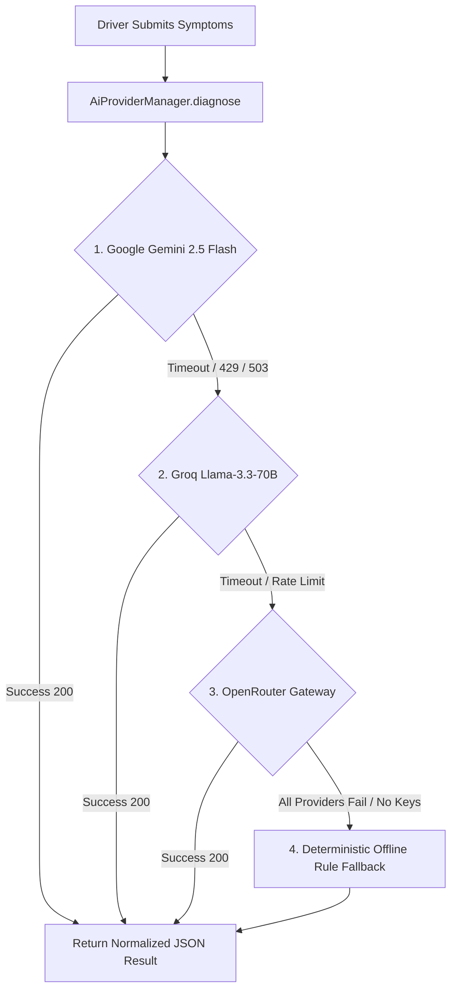

# RoadRescue - AI Diagnostic Module

## Overview

The RoadRescue AI Diagnostic module provides intelligent, real-time automotive triage for stranded drivers in Ghana. It translates natural language symptom descriptions into structured mechanical assessments, estimated root causes, urgency classifications, and safe roadside instructions before or during rescue dispatch.

---

## 1. Multi-Tier Provider Architecture & Fallback Engine

To guarantee 100% operational availability during roadside emergencies—even under cloud API rate limits (HTTP 429), quota exhaustion, service timeouts, or network degradation—RoadRescue implements a prioritized multi-tier provider chain managed by `AiProviderManager`:



### Provider Hierarchy
1. **Primary: Google Gemini (`GeminiProvider.js`)**
   * Default Model: `gemini-2.5-flash`
   * Characteristics: Fast, multimodal-ready, high reasoning accuracy on automotive diagnostics.
2. **First Fallback: Groq (`GroqProvider.js`)**
   * Default Model: `llama-3.3-70b-versatile`
   * Characteristics: Sub-second inference speed via Groq LPU hardware, automatic failover when Gemini quota is exceeded.
3. **Second Fallback: OpenRouter (`OpenRouterProvider.js`)**
   * Default Model: `meta-llama/llama-3.3-70b-instruct`
   * Characteristics: Resilient third-party gateway providing redundant upstream routing.
4. **Offline Resilience Engine: Deterministic Rule Fallback (`ruleFallback.js`)**
   * Characteristics: Zero external network dependencies. Analyzes symptom keywords against 7 specialized mechanical fault domains (Cooling, Electrical, Brakes, Transmission, Fuel, Powertrain, Tires/Suspension) and generates structured safety instructions formatted to the exact same schema.

---

## 2. Standardized Diagnostic Schema

Every provider (cloud LLM or offline rule engine) passes through `normalizeDiagnosticResult()` in `src/lib/ai/types.js` to enforce schema parity. The frontend never encounters differing response shapes.

### Schema Definition
```json
{
  "problem": "Concise description of the primary vehicle issue",
  "summary": "Short summary matching the problem",
  "fault_category": "Cooling System | Electrical & Battery | Brakes & Hydraulic | Engine & Powertrain | Fuel System | Tires & Suspension | Transmission & Drivetrain | General Mechanical | Other",
  "severity": "low | medium | high | critical",
  "recommendations": [
    "Up to 4 safe, actionable steps the driver should take immediately"
  ],
  "estimated_causes": [
    "Top 2-4 probable mechanical or electrical root causes"
  ],
  "provider": "gemini | groq | openrouter | rule-fallback",
  "isFallback": false,
  "fallbackReason": null
}
```

### Severity Levels & Visual Indicators

| Severity | Color Code | Meaning | Standard Action |
| :--- | :--- | :--- | :--- |
| **`critical`** | Red (`bg-red-500`) | Immediate hazard (e.g. brake failure, heavy smoke) | Stop vehicle immediately, turn off ignition, evacuate to safe distance. |
| **`high`** | Orange (`bg-amber-500`) | Serious failure preventing safe operation (e.g. overheating) | Pull over safely, shut off engine, request emergency mechanic dispatch. |
| **`medium`** | Yellow (`bg-yellow-500`) | Impaired performance (e.g. alternator failure, misfire) | Drive cautiously to nearest workshop or request mobile repair. |
| **`low`** | Blue (`bg-blue-500`) | Minor inconvenience (e.g. non-critical sensor, tire pressure) | Schedule regular maintenance; vehicle safe for short trips. |

---

## 3. System Prompt Engineering

All cloud LLM providers are instructed with a standardized automotive prompt tailored to the Ghanaian operational context:

```text
You are the RoadRescue diagnostic AI for Ghana. Review vehicle breakdown symptoms and provide a fast, reassuring, professional preliminary mechanical assessment.
Return only valid JSON matching this schema:
{
  "problem": "A concise description of the primary vehicle problem",
  "summary": "Short summary matching the problem",
  "fault_category": "One of: Brakes & Hydraulic, Cooling System, Electrical & Battery, Engine & Powertrain, Fuel System, Tires & Suspension, Transmission & Drivetrain, General Mechanical, Other",
  "severity": "One of: low, medium, high, critical",
  "recommendations": ["Up to 4 safe, actionable steps driver can take"],
  "estimated_causes": ["Top probable mechanical or electrical causes"]
}
```

---

## 4. Rate Limiting & CGNAT Handling in Ghana

### Carrier-Grade NAT (CGNAT) Challenge
In Ghana, major mobile network operators (MTN, Telecel, AT) route mobile data subscribers through Carrier-Grade NAT. Thousands of cellular devices share a single public IP address. Traditional IP-only rate limiting causes widespread false-positive blocks (HTTP 429) across unrelated motorists during peak traffic hours.

### Implemented Solution (`src/app/api/ai/diagnose/route.js`)
The diagnostic API resolves client rate-limiting keys using prioritized user identity:
1. **Authenticated User:** `user:${user.id}` (isolated quota per registered driver).
2. **Anonymous Fallback:** `ip:${clientIP}` (with sliding-window 20 requests/minute capacity).
3. **Graceful 429 Response:** If rate-limited, the endpoint does not return a blank error—it returns HTTP 429 along with an offline rule-based diagnosis so the stranded motorist is never left without guidance.

---

## 5. API Endpoint Reference

### `POST /api/ai/diagnose`

#### Request Headers
```http
Content-Type: application/json
```

#### Request Payload
```json
{
  "symptoms": "White steam coming from under the bonnet and temperature gauge in the red",
  "vehicleMake": "Toyota",
  "vehicleModel": "Corolla",
  "vehicleYear": 2018
}
```

#### Success Response (`200 OK`)
```json
{
  "success": true,
  "diagnosis": {
    "problem": "Engine Overheating / Radiator Coolant Failure",
    "summary": "Severe thermal escalation in engine cooling circuit",
    "fault_category": "Cooling System",
    "severity": "critical",
    "recommendations": [
      "Pull over safely and turn off the engine immediately.",
      "CAUTION: Never open the radiator cap while the engine is hot.",
      "Allow the engine to cool for at least 20-30 minutes before inspecting fluid levels.",
      "Request roadside assistance to prevent cracked engine block."
    ],
    "estimated_causes": [
      "Radiator hose puncture or coolant leak",
      "Failed water pump",
      "Stuck thermostat valve",
      "Blown head gasket"
    ],
    "provider": "gemini",
    "isFallback": false,
    "fallbackReason": null
  }
}
```

---

## 6. Frontend Integration & UI Components

* **`DiagnosticChat.jsx` (`src/components/ai/DiagnosticChat.jsx`):** Conversational symptom intake collecting vehicle year, make, model, and breakdown descriptions.
* **`DiagnosticResult.jsx` (`src/components/ai/DiagnosticResult.jsx`):** Renders color-coded severity badges, structured recommendations, estimated causes, provider attribution, and a 1-click CTA to automatically inject the diagnosis directly into the rescue request creation form.
* **`useDiagnostic.js` (`src/hooks/useDiagnostic.js`):** Custom React hook managing loading state, timeout handling, and toast notifications.
