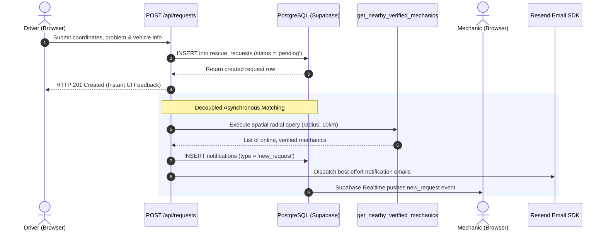
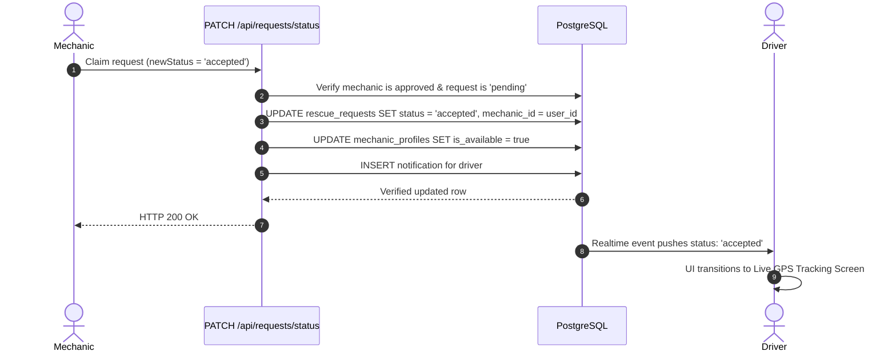

# RoadRescue System Architecture

> Formal technical architecture specification detailing frontend, backend, database layers, external integrations, data flows, and security boundaries.

---

## 1. High-Level Architecture

```mermaid
flowchart TD
    subgraph Client ["Client Presentation Layer (Next.js 16 + React 19)"]
        D_UI[Driver Dashboard & Map]
        M_UI[Mechanic Navigation & Feed]
        A_UI[Admin Matrix & Hotspots]
    end

    subgraph Edge ["Edge Protection & Middleware Layer"]
        MW[Edge Route Guard: proxy.js]
    end

    subgraph Backend ["Application & API Gateway (Route Handlers)"]
        AUTH_G[RBAC Guards: rbac.js]
        REQ_API[/api/requests/*]
        AI_API[/api/ai/diagnose]
        ADM_API[/api/admin/*]
        PROF_API[/api/profile/*]
        NOTIF_API[/api/notifications/*]
    end

    subgraph Persistence ["Data & Event Broker Layer (Supabase)"]
        PG[(PostgreSQL 15 + PostGIS)]
        RLS[Row-Level Security Policies]
        WS[Supabase Realtime CDC WebSockets]
        AUTH_SRV[Supabase Auth Engine]
        STOR[Supabase Storage Buckets]
    end

    subgraph External ["External Third-Party Ecosystem"]
        GEMINI[Google Gemini 2.5 Flash]
        GROQ[Groq Llama-3.3-70B]
        OPENROUTER[OpenRouter Gateway]
        RESEND[Resend Transactional Email]
        OSM[OpenStreetMap / Leaflet Tiles]
    end

    Client --> MW
    MW --> Backend
    Backend --> AUTH_G
    AUTH_G --> Persistence

    REQ_API --> PG
    AI_API --> GEMINI
    AI_API -.->|Failover| GROQ
    AI_API -.->|Failover| OPENROUTER
    NOTIF_API --> RESEND
    D_UI & M_UI --> OSM
    Persistence <-->|Bi-Directional State| Client
```

---

## 2. Layer Specifications

### 2.1 Frontend Presentation Layer
* **Framework:** Next.js 16.2.6 (App Router) with React 19 and Turbopack compiler.
* **Component Architecture:**
  * Server Components (`RSC`) for initial shell rendering and static metadata extraction.
  * Client Components (`'use client'`) for interactive maps, state subscriptions, forms, and camera captures.
* **Layout Design System:** Tailwind CSS v4 featuring a unified brand palette (Warm Cream `#FDFBF7`, Gold Amber `#F5C400`, Charcoal Slate `#1F1B10`).
* **Shared Mapping Shell:** `FullBleedMapShell.jsx` provides consistent 100% viewport map canvases across `/dashboard/driver/explore` and `/dashboard/mechanic/navigation`.
* **State Management:** Zustand stores (`useRequestStore`, `authStore`) for managing request creation wizards and session caching.

---

### 2.2 Edge Protection & Middleware Layer (`src/proxy.js`)
* Executes at the edge before any route handler or page segment is evaluated.
* Intercepts `/dashboard/*` and `/auth/*` paths.
* Validates Supabase JWT cookies, retrieves the verified database role (`driver`, `mechanic`, `admin`) from `public.profiles`, and redirects unauthenticated users or users attempting cross-role dashboard access to their respective home routes.

---

### 2.3 Application & API Gateway Layer (`src/app/api`)
* **REST Handlers:** Modular route handlers for requests, AI diagnostics, administrative oversight, and profile preferences.
* **RBAC Enforcement (`src/lib/rbac.js`):** Enforces role checks before executing business logic:
  * `requireDriver()`
  * `requireMechanic()`
  * `requireAdmin()`
* **Server-Side Client Generator (`src/lib/supabase/server.js`):**
  * `createClient()` — Scoped to authenticated user JWT (enforcing RLS).
  * `createServiceClient()` — Uses `SUPABASE_SERVICE_ROLE_KEY` to execute system-level operations (e.g. cross-user notifications, admin reviews, and email trigger audits).

---

### 2.4 Database & Persistence Layer (Supabase)
* **Storage Engine:** PostgreSQL 15+ with PostGIS spatial extension.
* **Spatial Matching:** Stored procedure `get_nearby_verified_mechanics(lat, lng, radius_km)` executes radial bounding box queries (`ST_DWithin`, `ST_Distance`) accelerated by GiST spatial indexes.
* **Database Triggers:**
  * `handles_new_auth_user()` automatically provisions role-specific sub-profiles (`driver_profiles` or `mechanic_profiles`) upon user registration.
  * `blocked_email_signup_trigger` checks registration attempts against `blocked_emails` and aborts signups from blacklisted accounts.
* **Realtime Broadcast:** Supabase Realtime listens to PostgreSQL WAL (Write-Ahead Logging) changes on `rescue_requests`, `messages`, and `notifications`, pushing events over WebSockets to active browser clients.

---

### 2.5 External Services & Resilience Strategy

| Service | Protocol | Primary Purpose | Fallback / Redundancy Strategy |
| :--- | :--- | :--- | :--- |
| **Google Gemini** | HTTPS REST | Primary AI breakdown triage | Fails over to Groq Llama-3.3, then OpenRouter, then offline rule engine |
| **Groq LPU** | HTTPS REST | First AI fallback provider | Ultra-fast inference failover if Gemini is rate-limited (HTTP 429) |
| **OpenRouter** | HTTPS REST | Second AI fallback provider | Multi-model upstream gateway |
| **Resend** | HTTPS REST | Transactional email dispatches | Non-blocking background promises; failure logged without breaking HTTP response |
| **OpenStreetMap / Leaflet** | HTTP Tile Cache | Map tiles & Geolocation | No vendor API key required; browser geolocation with manual geocoding fallback |

---

## 3. End-to-End Data Flows

### 3.1 Driver Distress Dispatch & Radial Matching



### 3.2 Mechanic Acceptance & Lifecycle Transition



---

## 4. Production Deployment Topology

```text
[Vercel Serverless Edge Platform]
       │
       ├── Global CDN (Static assets, Turbopack chunks)
       ├── Edge Middleware (proxy.js authentication checks)
       └── Serverless Node.js Route Handlers (API endpoints)
               │
               ▼
[Supabase Managed Cloud Infrastructure]
       │
       ├── Auth Server (JWT token issuance & session management)
       ├── PostgreSQL Database (PostGIS, RLS, WAL replication)
       ├── Realtime Server (WebSocket message distribution)
       └── Object Storage (mechanic-documents, vehicle-images)
```
