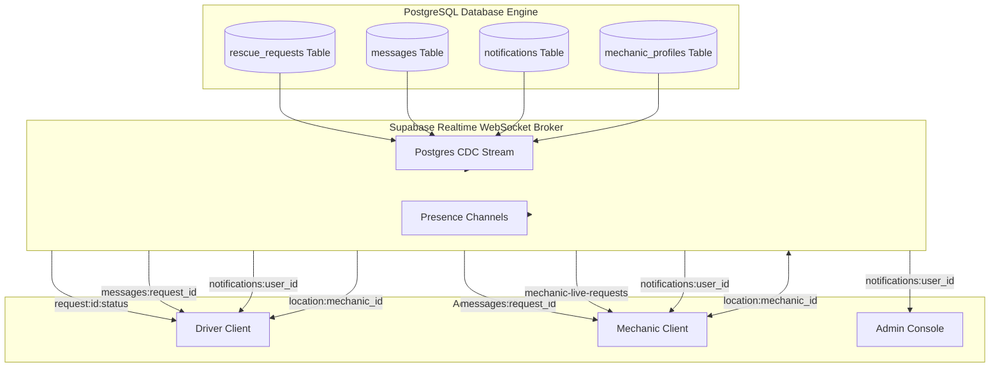

# RoadRescue Realtime Event & Synchronization Flow

> Specification of Supabase Realtime WebSocket event subscriptions, presence channels, and live GPS tracking data flows.

---

## 1. Overview

RoadRescue leverages **Supabase Realtime** to eliminate polling overhead and provide sub-second bi-directional synchronization across drivers, field mechanics, and operations command. Realtime listeners monitor PostgreSQL Change Data Capture (CDC) events on write-ahead logs (WAL) as well as ephemeral presence channels.

---

## 2. Event Subscription Architecture by User Role



---

## 3. Core Channel Implementations

### 3.1 Mechanic Live Dispatch Feed (`mechanic-live-requests`)
* **File:** `src/app/dashboard/mechanic/requests/page.jsx`
* **Purpose:** Provides verified mechanics with an instant notification whenever a new distress ticket is logged in their zone.
* **Subscription Code:**
  ```javascript
  const supabase = createClient()
  const channel = supabase
    .channel('mechanic-live-requests')
    .on(
      'postgres_changes',
      {
        event: '*',
        schema: 'public',
        table: 'rescue_requests',
      },
      () => {
        loadRequests() // Refetches pending queue immediately
      }
    )
    .subscribe()
  ```

---

### 3.2 Request Lifecycle Tracking (`request:${requestId}`)
* **File:** `src/app/dashboard/driver/request/[id]/page.jsx`
* **Purpose:** Updates driver status cards and progress steps automatically as the assigned mechanic progresses from `accepted` $\to$ `en_route` $\to$ `arrived` $\to$ `in_progress` $\to$ `completed`.
* **Subscription Code:**
  ```javascript
  const channel = supabase
    .channel(`request-live-${requestId}`)
    .on(
      'postgres_changes',
      {
        event: 'UPDATE',
        schema: 'public',
        table: 'rescue_requests',
        filter: `id=eq.${requestId}`,
      },
      (payload) => {
        const updatedStatus = payload.new.status
        setRequest(prev => ({ ...prev, status: updatedStatus }))
      }
    )
    .subscribe()
  ```

---

### 3.3 Live Incident Chat (`messages:${requestId}`)
* **File:** `src/components/request/RescueChatPanel.jsx`
* **Purpose:** Enables instant, low-latency text messaging between the stranded driver and assigned mechanic.
* **Subscription Code:**
  ```javascript
  const channel = supabase
    .channel(`chat-room-${requestId}`)
    .on(
      'postgres_changes',
      {
        event: 'INSERT',
        schema: 'public',
        table: 'messages',
        filter: `request_id=eq.${requestId}`,
      },
      (payload) => {
        setMessages(prev => [...prev, payload.new])
      }
    )
    .subscribe()
  ```

---

### 3.4 Bidirectional Mechanic Location Tracking (`useMechanicLocation.js`)
* **Broadcasting (Mechanic):** When `is_available === true`, the mechanic's device uses `navigator.geolocation.watchPosition` to publish coordinates over WebSocket presence every 15 seconds, and updates `mechanic_profiles.current_location` in PostgreSQL every 60 seconds.
* **Receiving (Driver):** The driver's map component subscribes to the mechanic's location broadcast and smoothly updates the Leaflet marker icon on the map canvas.

---

## 4. Resilience & Fallback Guarantees

1. **Automatic WebSocket Reconnection:** If mobile cellular data drops temporarily (e.g. driving through a low-signal zone in Accra), the Supabase client handles exponential reconnection attempts.
2. **Hybrid Polling Fallback:** Critical operational feeds (such as the mechanic dispatch board) maintain a 30-second background polling cycle as a fallback in the event of persistent WebSocket disconnection.
3. **Duty Status Lock:** When a mechanic toggles offline (`is_available = false`), all GPS tracking watchers and WebSocket broadcast channels are terminated immediately to preserve battery and respect user privacy.