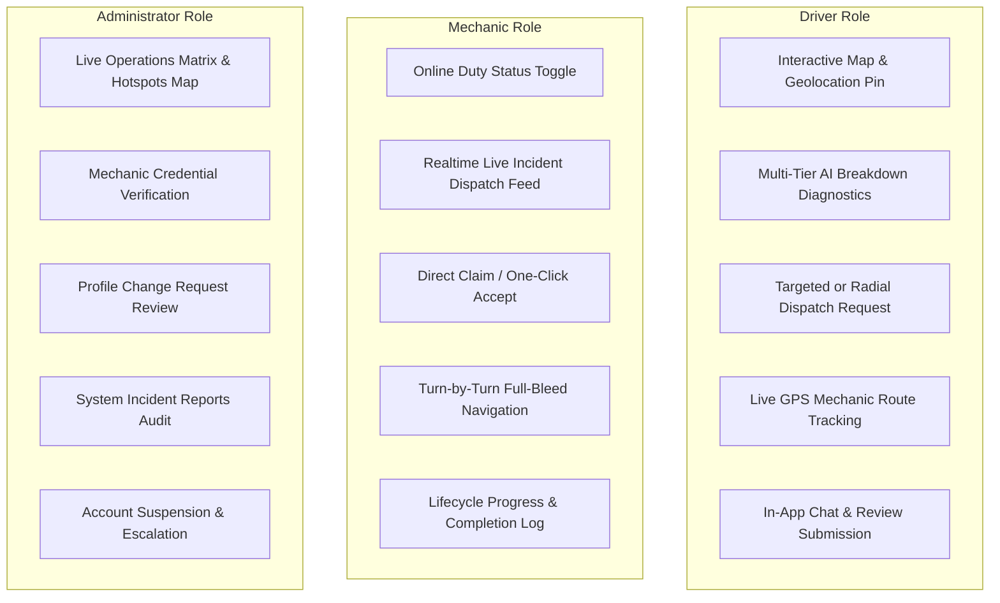

# RoadRescue: A Secure Roadside Assistance Platform

> **An intelligent, real-time emergency dispatch and diagnostic coordination platform connecting stranded drivers with nearby verified mechanics in Ghana.**

[](https://nextjs.org/)
[](https://react.dev/)
[](https://tailwindcss.com/)
[](https://supabase.com/)

---

## 1. Project Overview & Problem Statement

### The Problem
Vehicle breakdowns in developing urban ecosystems like Accra, Ghana are typically stressful, unpredictable, and insecure. Stranded motorists are forced to rely on unverified phone contacts, roadside negotiations, long response delays, and uncertain mechanic competencies. Traditional roadside assistance lacks real-time coordination, transparent location tracking, and systematic diagnostic triage.

### The Solution
**RoadRescue** provides an end-to-end, real-time roadside assistance ecosystem:
* **Sub-Second Spatial Dispatch:** Automated matching using PostGIS spatial indexing (`ST_DWithin`, `ST_Distance`) over active mechanic coordinates within a 10 km radius.
* **Multi-Tier AI Diagnostics:** Automated breakdown assessment utilizing a prioritized multi-provider fallback engine (Google Gemini $\to$ Groq Llama-3.3 $\to$ OpenRouter $\to$ Offline Rule-Based Expert System).
* **Live Bidirectional Tracking:** Supabase Postgres Change Data Capture (CDC) and WebSocket subscriptions for live GPS tracking from `accepted` $\to$ `en_route` $\to$ `arrived` $\to$ `in_progress` $\to$ `completed`.
* **Verified Specialist Network:** Administrative credential verification with database-level email blacklisting (`blocked_emails`) and soft-cascade account termination.
* **Alternative Commute Integration:** Direct escape gateway to urban ride-hailing services (Uber, Bolt, Yango) if on-site repair is infeasible.

---

## 2. Key Features by User Role



---

## 3. Technology Stack

| Layer | Technologies | Purpose |
| :--- | :--- | :--- |
| **Frontend** | Next.js 16 (App Router, Turbopack), React 19, Tailwind CSS v4, Framer Motion | High-performance, responsive UI with server-side rendering and mobile-first layouts |
| **Maps & Geolocation** | Leaflet, React-Leaflet, OpenStreetMap, Nominatim API | Interactive mapping, GPS pinning, and reverse geocoding without vendor API key lock-in |
| **Backend / API** | Next.js Route Handlers, Node.js runtime, Edge middleware (`proxy.js`) | REST API endpoints, RBAC middleware, and server-side lifecycle transition enforcement |
| **Database & Realtime** | Supabase (PostgreSQL 15+, PostGIS spatial extensions, Realtime CDC) | Relational persistence, spatial indexing (GiST), and WebSocket event broadcasting |
| **AI Diagnostic Chain** | Gemini 2.5 Flash, Groq (Llama-3.3-70B), OpenRouter, Deterministic Offline Engine | Resilient multi-tier automotive fault classification with structured JSON schema output |
| **Transactional Email** | Resend API SDK | Automated email notifications for dispatches, status changes, and administrative actions |
| **State Management** | Zustand stores (`useRequestStore`, `authStore`) | Predictable client-side state across multi-step forms and authentication flows |

---

## 4. Rescue Request State Machine

All rescue status updates are strictly validated server-side in `src/lib/request.js` and `src/app/api/requests/status/route.js`. Clients cannot bypass state transitions directly in the database.

```text
               ┌───────────────► CANCELLED ◄───────────────┐
               │                     ▲                     │
               │ (Driver/Mechanic)   │ (Driver/Mechanic)   │ (System Timeout)
               │                     │                     │
[PENDING] ─────┴───────► [ACCEPTED] ─┴──────► [EN_ROUTE] ──┴──► [ARRIVED]
                                                                    │
[COMPLETED] ◄────────────────── [IN_PROGRESS] ◄─────────────────────┘
```

### Transition & Cancellation Rules
1. **Pending $\to$ Accepted:** Only verified mechanics (`verification_status = 'approved'`) who are online can accept unassigned requests.
2. **Accepted $\to$ En Route $\to$ Arrived $\to$ In Progress $\to$ Completed:** Only the assigned mechanic or an administrator can progress the job.
3. **Cancellation Authority:**
   * **Drivers:** Can cancel during `pending`, `accepted`, or `en_route`. Cancellation is blocked once the mechanic has `arrived` or work is `in_progress`.
   * **Mechanics:** Can cancel before work begins (`accepted`, `en_route`, `arrived`) with a mandatory cancellation reason. Work `in_progress` requires dispute/incident reporting.
   * **System Timeout (`/api/requests/auto-cancel`):** Automatically cancels expired pending requests if no mechanic claims them.
   * **Admins:** Can cancel or reassign requests at any stage for operational recovery.

---

## 5. Repository Structure

```text
roadrescue/
├── docs/                               # Formal architectural & engineering documentation
│   ├── ai-diagnostic.md                # Multi-tier AI architecture & schema definitions
│   ├── api-reference.md                # Comprehensive Next.js API route specifications
│   ├── architecture.md                 # System components, integrations, and deployment model
│   ├── db-schema.md                    # Database tables, relationships, and PostGIS queries
│   ├── DEVELOPER_NOTES.md              # Technical implementation notes & developer conventions
│   ├── realtime-flow.md                # Supabase Realtime subscriptions & event lifecycles
│   ├── rls-policies.md                 # Row-Level Security policies per table
│   └── state-machine.md                # State transition diagram and validation rules
├── supabase/                           # Database migrations and seed configurations
│   ├── migrations/                     # Sequential SQL migration files
│   ├── config.toml                     # Supabase local development configuration
│   └── seed.sql                        # Demonstration seed accounts and test records
├── web/                                # Next.js web application
│   ├── public/                         # Static assets, icons, and manifest
│   ├── src/
│   │   ├── app/                        # Next.js App Router (pages & API routes)
│   │   │   ├── api/                    # Server-side API endpoints
│   │   │   │   ├── admin/              # Administrative endpoints (mechanics, users, stats)
│   │   │   │   ├── ai/diagnose/        # Multi-provider AI diagnostic route
│   │   │   │   ├── notifications/      # Notification endpoints (email relay)
│   │   │   │   ├── profile/            # Profile preferences & change requests
│   │   │   │   ├── reports/            # Incident reporting endpoint
│   │   │   │   └── requests/           # Core rescue request lifecycle & chat endpoints
│   │   │   ├── auth/                   # Authentication pages (login, register)
│   │   │   └── dashboard/              # Role-protected dashboards (driver, mechanic, admin)
│   │   ├── components/                 # Reusable UI, Map, AI, and Layout components
│   │   ├── hooks/                      # Custom React hooks (auth, location, realtime, diagnostics)
│   │   ├── lib/                        # Server helpers, rate limiters, AI providers, and RBAC guards
│   │   │   ├── ai/                     # AI Provider Manager and provider implementations
│   │   │   └── supabase/               # Supabase browser and server client initializers
│   │   ├── providers/                  # Context providers (AuthProvider)
│   │   ├── stores/                     # Zustand state stores
│   │   └── proxy.js                    # Next.js edge route protection & RBAC middleware
│   ├── .env.example                    # Environment variable template
│   ├── package.json                    # Node dependencies and scripts
│   └── vercel.json                     # Vercel deployment configuration
└── README.md                           # Root project documentation (this file)
```

---

## 6. Quick Start & Local Setup

### Prerequisites
* **Node.js:** v18.18.0 or higher (Node.js 20+ recommended)
* **npm:** v9+ or **pnpm** / **yarn**
* **Supabase Project:** Free cloud instance at [supabase.com](https://supabase.com) or local Supabase CLI

### Step 1: Clone Repository & Install Dependencies
```bash
git clone https://github.com/Handson-A/roadrescue.git
cd roadrescue/web
npm install
```

### Step 2: Configure Environment Variables
Create `.env.local` inside the `web/` directory:
```bash
cp .env.example .env.local
```
Fill in your configuration:
```env
# Supabase Configuration (Required)
NEXT_PUBLIC_SUPABASE_URL=https://your-project.supabase.co
NEXT_PUBLIC_SUPABASE_ANON_KEY=eyJhbGciOi...
SUPABASE_SERVICE_ROLE_KEY=eyJhbGciOi...

# AI Diagnostics Providers (At least one required for cloud LLM; offline fallback works without keys)
GEMINI_API_KEY=your_gemini_api_key
GEMINI_MODEL=gemini-2.5-flash

# Fallback AI Providers (Optional but recommended)
GROQ_API_KEY=your_groq_api_key
GROQ_MODEL=llama-3.3-70b-versatile
OPENROUTER_API_KEY=your_openrouter_api_key
OPENROUTER_MODEL=meta-llama/llama-3.3-70b-instruct
AI_PROVIDER_TIMEOUT_MS=7000

# Email Service (Optional for local testing; required for production email notifications)
RESEND_API_KEY=re_...
RESEND_FROM_EMAIL=RoadRescue <onboarding@resend.dev>

# Application Base URL
NEXT_PUBLIC_APP_URL=http://localhost:3000
```

### Step 3: Database Setup
Apply all database migrations in `supabase/migrations/` sequentially using the Supabase SQL Editor or Supabase CLI:
```bash
# If using Supabase CLI locally:
supabase db reset
```

### Step 4: Run Development Server
```bash
npm run dev
```
Open [http://localhost:3000](http://localhost:3000) in your browser.

---

## 7. Build, Verification & Testing

```bash
# Compile and validate production build with Turbopack
npm run build

# Run ESLint validation
npm run lint
```

### Automated End-to-End Build Verification
The application undergoes full static optimization and compile-time verification across all 57 static and dynamic route segments:
```text
✓ Compiled successfully in 20.9s
  Running TypeScript ...
  Finished TypeScript in 270ms ...
✓ Generating static pages using 11 workers (57/57)
```

---

## 8. Multi-Layer Security & RBAC

1. **Edge Middleware Fencing (`src/proxy.js`):** Intercepts requests to `/dashboard/*` and `/auth/*`, validates the active Supabase session, queries the user's verified role from `public.profiles`, and redirects unauthorized roles to their respective dashboards.
2. **API Route Guards (`src/lib/rbac.js`):** Every API endpoint enforces role requirements (`requireAdmin()`, `requireMechanic()`, `requireDriver()`) before executing business logic.
3. **Database Row-Level Security (RLS):** PostgreSQL policies scope data access at the engine level:
   * Drivers can only read/write their own rescue requests.
   * Mechanics can only view unassigned pending requests or jobs assigned specifically to them.
   * In-app chat messages are restricted strictly to the request's driver and assigned mechanic.
4. **Email Relay Hardening:** `/api/notifications/email` blocks non-admin users from sending arbitrary emails to unverified recipients. Normal users can only dispatch system notifications to their own verified email.
5. **Rate Limiting:** Sliding-window rate limiters protect sensitive endpoints (e.g. 20 req/min for AI diagnostics, 3 requests/hr for distress calls).
6. **Input Sanitization:** Recursive HTML stripping and character encoding in `src/lib/validate.js` prevent Cross-Site Scripting (XSS) and injection attacks.

---

## 9. Comprehensive Documentation Index

For detailed architectural specifications, consult the dedicated documentation files:

*  **[System Architecture](docs/architecture.md)** — Architectural layers, client-server interactions, and integrations.
*  **[API Reference](docs/api-reference.md)** — Complete specifications for all REST endpoints, parameters, and responses.
*  **[Database Schema](docs/db-schema.md)** — Complete PostgreSQL table schemas, indexes, and PostGIS spatial functions.
*  **[AI Diagnostic Module](docs/ai-diagnostic.md)** — Multi-provider fallback chain, JSON schema, and prompt engineering.
*  **[State Machine](docs/state-machine.md)** — Formal rescue request state transition graph and validation rules.
*  **[RLS Security Policies](docs/rls-policies.md)** — PostgreSQL Row-Level Security policy definitions per table.
*  **[Realtime Event Flow](docs/realtime-flow.md)** — WebSocket subscription patterns and live tracking mechanics.
*  **[Deployment Guide](web/DEPLOYMENT_GUIDE.md)** — Production deployment instructions for Vercel and Supabase.
*  **[Technical Briefcase / Viva Kit](TECHNICAL_BRIEFCASE.md)** — Academic defense questions, answers, and technical highlights.

---

## 10.  Academic Attribution

Developed as a Final Year Project (FYP) in Computer Science / Software Engineering.   
Copyright © 2026 RoadRescue. All rights reserved.
